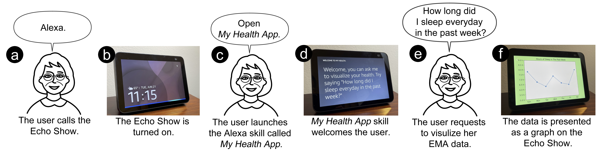
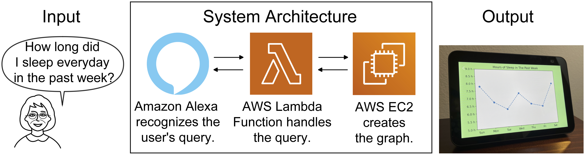

# Towards Visualization of Time-Series Ecological Momentary Assessment (EMA) Data on Standalone Voice-First Virtual Assistants
Yichen Han, Christopher Bo Han, Chen Chen, Peng Wei Lee, Michael Hogarth, Alison A. Moore, Nadir Weibel, Emilia Farcas


This work is a part of [VOLI Project](http://voli.ucsd.edu/) at UC San Diego [Human-Centered Extented Intelligence Lab](https://hxi.ucsd.edu/). You may read the full [Paper]() and watch the [Video Presentation](https://www.youtube.com/watch?v=MPd0Dlc1IPs).


## Introduction
Accessing and interacting with digital health information is a key challange for aging populations. Ecological Momentary Assessments (EMA) coupled with voice-based Intelligent Virtual Assistants (IVAs) can be effective to improve older adults Quality of Life.

To explore the potential opportunities for visualizing time-series based EMA data on standalone IVAs, we prototyped this preliminary system. Via this system, oler users are able to query and examine their time-series EMA data on Amazon Echo Show.



By observing and interacting with the IVA visualization, and especially older adults’ past data and corresponding trends, older users might be able
to make in-situ decisions to address possible unhealthy lifestyle. This artifact will also help future system development with more categories of real-time data and studies on the effectiveness of their visualizations.

## System Design
We prototyped the system based on Amazon Alexa and Amazon Web Services (AWS). It consists of three parts: (1) an Amazon Alexa frontend converting users’ utterances to queries, (2) an AWS Lambda middle-tier that handles the queries and requests the graphs, and (3) a AWS EC2 server to generate the graphs.



## Quick Start
You may deploy the system in a simplified way with only Alexa Skill and AWS Lambda, or make a full deployment with AWS EC2 server as well.

## Prerequisites
+ An Amazon developer account and its ```IAM user name``` and ```access key``` ([Reference](https://docs.aws.amazon.com/powershell/latest/userguide/pstools-appendix-sign-up.html)).
+ ```AWS CLI``` is configured with credentials.

## Simple Deployment
With Amazon Alexa and AWS Lambda, you can test the system by showing static figures on the Echo Show.

### 1. Deploy Alexa Skill:
Go to [Alexa Console](https://developer.amazon.com/alexa/console/ask) and create a with a self-hosted backend. Record its ```Skill ID```.

Connect its ```Endpoint``` to the Lambda Function in the next part by entering its ```Function ARN```.

### 2. Deploy AWS Lambda:
Enter the ```lambda``` folder, then run these commands (replace contents in <> with your owns'):

```
$ aws lambda create-function --function-name voli-visualization-exploratory --zip-file fileb://system-demo.zip --handler index.handler --runtime nodejs16.x --role arn:aws:iam::<ID>:role/<Role name>

$ aws lambda update-function-code --function-name voli-visualization-exploratory --zip-file fileb://system-demo.zip
```

By this time, you are able to see a Function in AWS Lambda named ```voli-visualization-exploratory```. Open it, click ```Add trigger```, select ```Alexa```, and enter the ```Skill ID``` in Part 1.

## Server Deployment
With the Falsk server delopyed on AWS EC2, you are able to display real-time figures on the Echo Show generated from the server.

After deploying the server on EC2, just run it by ```$ python3 start.py```. 
<!-- Then you can change the URL of ```backgroundImageSource``` in ```/lambda/documents/visualization_background_document.json``` to the URL returning images in ```server/app/api.py```.  -->

## Citation
```
@inproceedings{han2022towards,
author = {Han, Yichen and Han, Christopher Bo and Chen, Chen and Lee, Peng Wei and Hogarth, Michael and Moore, Alison A. and Weibel, Nadir and Farcas, Emilia},
title = {Towards Visualization of Time-Series Ecological Momentary Assessment (EMA) Data on Standalone Voice-First Virtual Assistants},
year = (2022),
publisher = {Association for Computing Machinery},
address = {New York, NY, USA},
url = (https://doi.org/10.1145/3517428.3550398)
doi = {10.1145/3517428.3550398},
keywords = {Gerontechnology, Accessibility, Health – Well-being, User Experience Design, Older Adults, Voice User Interfaces, EMA},
location = {Athens, Greece},
series = {ASSETS '22}
}
```
